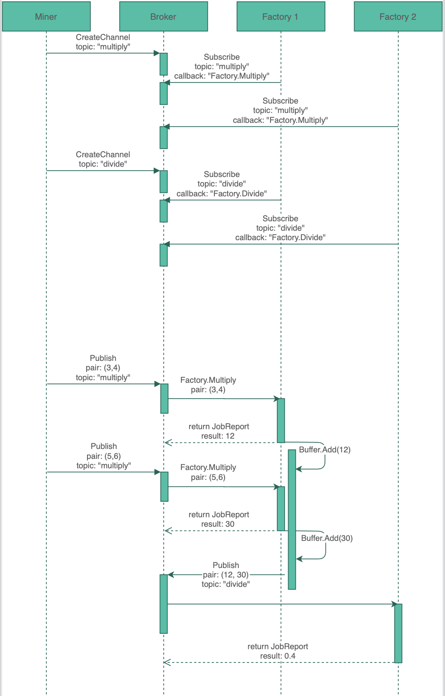

# Distributed Lab 3: Message Broker in Go

## Using the lab sheet

There are two ways to use the lab sheet, you can either:

- [create a new repo from this template](https://github.com/UoB-CSA/distributed-lab-3/generate) - **this is the recommended way**
- download a [zip file](https://github.com/UoB-CSA/distributed-lab-3/archive/master.zip)

## Ratings

Each question is rated to help you balance your work:

- :red_circle::white_circle::white_circle::white_circle::white_circle: - Easy, strictly necessary.
- :red_circle::red_circle::white_circle::white_circle::white_circle: - Medium, still necessary.
- :red_circle::red_circle::red_circle::white_circle::white_circle: - Hard, necessary if you're aiming for higher marks.
- :red_circle::red_circle::red_circle::red_circle::white_circle: - Hard, useful for coursework extensions.
- :red_circle::red_circle::red_circle::red_circle::red_circle: - Hard, beyond what you need for any part of the coursework.

## Introduction

We are going to use a variant of the publish-subscribe model which uses a
message broker for distributing work between many contributors.

The typical publish-subscribe model sends messages to all subscribers signed up
to a topic. This works for distributing events that all subscribers should see
or act on. For the case where we want just one subscriber to see an event, we
want something more like a [worker pool](https://gobyexample.com/worker-pools)
that accepts new machines joining the pool remotely and uses 'take' semantics to
avoid workers duplicating work.

## Part 1: The Multiply Factory :red_circle::red_circle::white_circle::white_circle::white_circle:

Look at the skeleton code you've been given. There are two complete components:

1. A `broker` that handles creating channels, publishing `stubs.Pair` events to
those channels, and subscriptions to those channels. When a subscriber sends a
`stubs.Subscription` to a running instance of the broker, it will get callbacks
for work whenever it is available.

2. A `miner` that generates `stubs.Pair` events and publishes them to a
`multiply` channel on the broker.

You should be able to launch the broker with `go run broker/broker.go` and the
miner with `go run miner/miner.go` -- nothing visible should happen except that
the broker will print out a notification that the `multiply` channel has been
created.

Your first task is to complete the `Factory` in `factory/factory.go`.

This factory should be a worker that:

- sets up an RPC *server* that registers a `Multiply` procedure. This procedure
  should accept a `stubs.Pair` and respond with a `stubs.JobReport`. You may
also want to print out the operation, so you can see what the instance is doing
while it's running. 
- connects to the broker as an RPC *client*.
- sends a `stubs.Subscription` request to the `multiply` channel, containing its
  own `ip:port` string and the correct string for the broker to use to call its
`Multiply` procedure.

The required mechanism is illustrated in the sequence diagram below.


You'll know if this is working correctly because once the factory is subscribed
the broker will start sending it work and printing out the results of jobs.

You should be able to: 

1.  Stop and restart the factory.

2. run a second instance of the factory, and have it also process work.  *Note:
you will need to tell the second factory to use a different port for its RPC
server*.


## Part 2: The Multiply-Divide Pipeline

### Part 2a: Division :red_circle::red_circle::white_circle::white_circle::white_circle:

Following the same steps, add a `Divide` procedure. It should also accept a `stubs.Pair` as the request and respond with a `stubs.JobReport`.

Test your new procedure using two miners:

```bash
Miner 1
go run miner/miner.go

Miner 2
go run miner/miner.go -topic divide
```

You'll know the code is working when the broker reports results for division operations. You should be able run multiple instances of your Factory (on different ports), and stop and start each of them.

### Part 2b: Creating a Pipeline :red_circle::red_circle::red_circle::white_circle::white_circle:

In this part you will link your `Multiply` and `Divide` procedures to create a pipeline. For every *two* `Multiply` results produced, the factory should ask the broker to `Divide` them by each other.

This can be achieved by adding a new goroutine in the factory. When a `Multiply` procedure is completed, the factory should send each result to this goroutine. Once the goroutine has received two values, it should `Publish` a new `Pair` to the broker under the `divide` topic. It should then continue to wait for further results from the `Multiply` procedure.

The required mechanism is illustrated in the sequence diagram below.



Test your pipeline using a single "multiply" miner. Do not use a "divide" miner this time.

```bash
go run miner/miner.go
```

You'll know the code is working when the broker reports results for division operations (the divisions will be the result of the pipeline). Again, you should be able run multiple instances of your Factory (on different ports), and stop and start each of them.

## Part 3: Triplets :red_circle::red_circle::red_circle::white_circle::white_circle:

The entire pipeline currently operates on `stubs.Pair`s. Modify it so that it
instead works with Triplets of three integers. As well as the `factory`, you
will need to edit the `miner` and `broker` code to accomplish this, and make a
decision about what Divide means for three integer arguments.